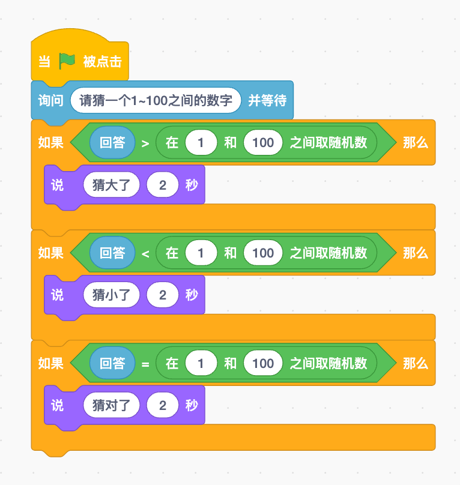

# 思路

## 引入部分
在上课之前，我们先来玩一个游戏，这个游戏叫作 "猜数字"。

...介绍猜数字的游戏。（想一个数字，从1~100)然后你来猜。

老师想，同学猜。猜三次，思考怎么猜才能猜的更快。

之后老师做一个总结，也就是每次猜中间的数字。能够保证用最少的猜次数猜出数字。

## 思考部分

1. 首先拆分游戏流程。
    1. 老师先想一个数字，从1~100之间。
    2. 老师提问，你要猜的数字是多少。
    3. 你来回答
    4. 老师根据你的回答，来告诉你，你猜的数字是大了，还是小了。
    5. 你继续猜，直到猜对为止。

## 分析部分

问：想的这个数字是怎么样的？
答：随机的。

问：使用什么积木块呢？
运算里面的，取随机数。

现在我们可以取到随机数了，下一步是什么呢？

很显然是，是老师提问。这个提问在哪里呢？
在侦测里面，有一个询问并等待。同时配套的还有一个回答。我们发现，这个回答前面有一个？
圆圈，所以这是一个？变量

我们自己来动手试一试。使用一下询问并等待。看看会出现什么情况？

然后继续，这个时候，你会发现。我们键盘输入的数字，存放到了？
回答当中。

没错。我们现在只需要用回答中的数字，来和老师想的数字来比较就好了对吧。

没错。那自己来完成比大小的任务。

现在，我们来看看，有没有什么bug。自己尝试运行一下游戏看看。

对的，游戏有三种情况，所以我们要使用三个不同的如果语句。

那现在下面这个有什么错误呢？

没错，电脑想的数字是随机的，应该要存到脑袋里面再来判断。每次判断的时候都是用这个数字。

现在这个代码的问题就是，每次判断的时候，都重新生成了一个数字，而不是用之前生成的数字。

现在没问题了，但是我们只能猜一次。所以我们需要使用什么积木块呢？

很显然，是重复执行。

那么，自己想一想，重复执行要包括哪些步骤？

最后，自己来完成这个代码。并且修复最后一个Bug。

自己想一想Bug是什么
