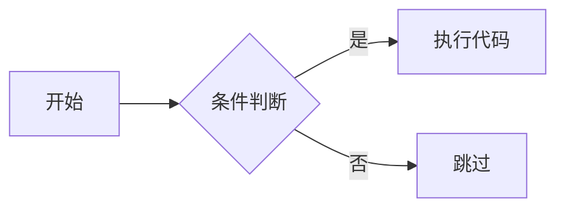

# 图表生成规范

本技能用于在教案和 PPT 中生成各类图表、可视化内容和交互动画。

## 图表选择策略

根据内容类型选择合适的可视化工具：

| 内容类型 | 推荐工具 | 说明 |
|---------|---------|------|
| 代码执行流程 | D2 | 清晰展示执行顺序 |
| 概念/架构图 | Mermaid | 快速生成 |
| 复杂结构图 | Draw.io XML | 可导出编辑 |
| 数组/排序/动态演示 | HTML/CSS/JS 动画 | 一步一步看过程 |
| 语法交互（变量/判断/循环） | HTML/CSS/JS 交互 | 点击/输入看每一步结果 |

## 工具使用规范

### D2 使用

```d2
shape: flowchart
direction: left

code_start -> read_line -> parse -> execute -> output
```

### Mermaid 使用



### HTML/CSS/JS 动画示例

```html
<div id="array-demo">
  <div class="item highlight">5</div>
  <div class="item">3</div>
  <div class="item">8</div>
</div>
<style>
.highlight { background: #3b82f6; color: white; }
</style>
<script>
const items = document.querySelectorAll('.item');
let index = 0;

function highlightNext() {
    items.forEach((item, i) => {
        item.classList.toggle('highlight', i === index);
    });
    index = (index + 1) % items.length;
}

setInterval(highlightNext, 800);
</script>
```

## 典型场景

### 变量赋值
- 使用 HTML 输入框，键入代码即时显示结果

### if/else 判断
- 流程图 + 点击分支看执行结果

### for 循环
- 动画展示变量变化、循环计数器

### 数组遍历
- 指针移动 + 高亮当前元素

### 冒泡排序
- 逐帧动画展示交换过程

## 生成流程

1. 理解内容需求
2. 选择合适工具
3. 生成代码/语法
4. 插入到教案或 PPT
