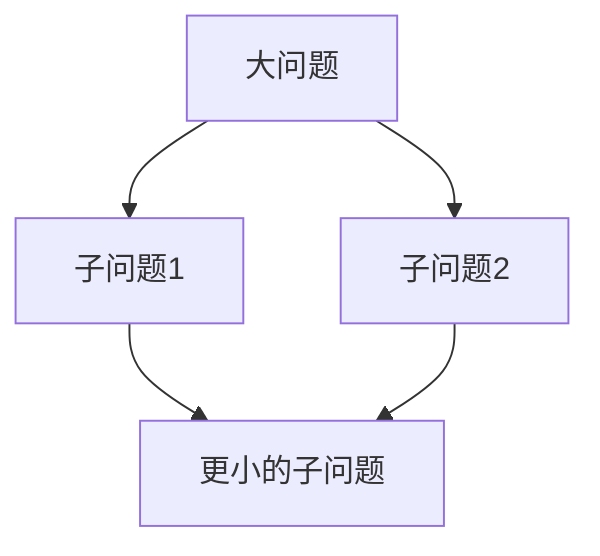

# 教案生成规范

## 核心原则

### 1. 模块化思维（工程化意识）

**每个知识点必须回答这三个问题：**

| 问题 | 含义 | 示例 |
|------|------|------|
| 这个东西"是什么"？ | 表面概念 | print() 是一个函数 |
| 它的"本质"是什么？ | 底层原理 | print() 的本质是控制终端打印内容 |
| 它属于哪个"模块"？ | 在系统中的位置 | print() 属于 Python 的**输出模块**，是**人机交互**的一部分 |

**本质追问的常用角度：**

- 这个函数/语法**控制了什么底层硬件**？
- 它**封装了什么复杂操作**？
- 它是**哪一层抽象**？（硬件 → OS → 语言 runtime → 应用）
- 它**输入什么，输出什么**？

**模块化视角：**

```
程序 = 模块1 + 模块2 + 模块3 + ...
每个模块 = 输入 → 处理 → 输出
```

### 2. 编程思维流程（问题拆分）

**核心流程：**

```
遇到问题
  → 拆分问题（拆成子问题）
    → 拆分问题（再拆）
      → ...直到每个小问题都能用代码解决
```

**拆分原则：**

- 拆到"**一句话能说清楚**"为止
- 拆到"**能用一行代码解决**"为止
- 拆到"**不需要再拆分**"为止

**拆分示例：**

```
问题：如何让程序"打招呼"？
拆分：
1. 需要输出文字 → print() 函数（输出模块）
2. 文字内容是什么 → 字符串 "Hello"
3. 谁来执行 → 计算机（执行模块）

→ print("Hello")
```

---

## 触发方式

- 命令: `/生成教案 课时名`
- 对话: "帮我写一节关于 XX 的教案"

## 半自动流程

1. 用户提供授课思路
2. AI 生成预览
3. 用户确认/修改
4. AI 写入文件

## YAML Front Matter

```yaml
---
title: 课时名称
description: 简短描述
prerequisites: 前置知识（可选）
module: 所属模块（如：输出模块、输入模块、计算模块）
---
```

## Markdown 结构

```markdown
# 标题

## 学习目标
- 掌握 xxx（能用代码实现）
- 理解 xxx 的本质（能说清楚原理）
- 理解 xxx 在系统中的位置（属于哪个模块）

## 内容

### 引入：从一个问题开始
[用一个生活中的问题引入，让学生思考]

### 概念讲解
**xxx 是什么？**
- 定义
- 它的本质是...（重点！）
- 它属于哪个模块...

### 编程思维训练：拆分问题
[用流程图或步骤分解展示如何拆分]

### 代码示例
```python
# 代码
```
**本质解读**：这行代码做了什么？（控制了什么？输入什么？输出什么？）

### 交互演示
[嵌入 HTML/CSS/JS 交互代码]

## 练习题
1. 题目（要求学生拆解问题后写出代码）
2. 题目

## 小结
- 回顾重点
- 本质是什么
- 属于哪个模块
```

## 风格要求

- **本质优先** — 每个概念必须讲清"本质是什么"
- **模块化视角** — 让学生建立"程序 = 模块组合"的概念
- **拆分思维** — 通过例子训练"大问题拆成小问题"的思维方式
- **循序渐进** — 从简单到复杂
- **代码注释** — 关键行添加注释说明

## 图表集成

在需要的位置插入图表：

```html
<!-- 拆分问题流程图 -->
<div class="diagram mermaid">

</div>

<!-- 本质解释图 -->
<div class="diagram">
    <pre>
输入 → [模块/函数] → 输出
    </pre>
</div>

<!-- HTML/CSS/JS 交互 -->
<div class="interactive-demo" id="demo-01">
    <input type="text" id="code-input" placeholder="输入代码...">
    <div id="output"></div>
</div>
```

## 文件输出

输出路径: `courses/课程名/课时名/教案.md`
