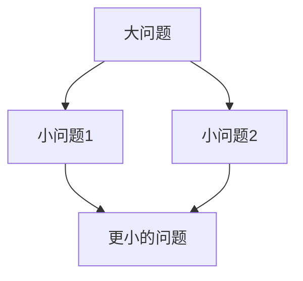

# 教案生成规范

## 核心原则

### 1. 语言通俗易懂（最重要！）

**面向零基础初学者，避免专业词汇：**

| 应该用的词 | 避免用的词 |
|-----------|-----------|
| 命令、指令 | 函数（除非解释清楚） |
| 显示出来、打印 | 输出、打印 |
| 记住、存放 | 存储、赋值 |
| 拆解问题 | 拆分问题（太技术化） |
| 实际上在做一件什么事 | 本质是什么（太抽象） |
| 部件、组件 | 模块（太技术化） |
| 一件什么事 | 什么操作 |

**每讲一个概念，必须用生活类比：**

```
概念 → 生活例子 → 代码实现
```

**常用生活类比库：**

| 概念 | 生活类比 |
|------|---------|
| 程序/代码 | 食谱、说明书 |
| 计算机三大步 | 餐厅服务员（接单→做菜→上菜） |
| 函数/命令 | 遥控器按钮 |
| 变量 | 储物柜/便利贴 |
| 循环 | 重复做同一件事 |
| 判断 | 遇到岔路口做选择 |

---

### 2. 编程思维流程（问题拆解）

**核心流程：**

```
遇到问题
  → 拆解问题（拆成小问题）
    → 再拆解
      → 直到每个小问题都能用代码解决
```

**拆解原则：**

- 拆到"**一句话能说清楚**"为止
- 拆到"**一个命令能解决**"为止
- 拆到"**不需要再拆**"为止

**拆解示例：**

```
问题：让计算机显示 "Hello"
拆解：
1. 显示在哪里？→ 屏幕
2. 怎么让屏幕显示？→ 用一个"命令"
3. 什么命令？→ print() = "显示出来"

→ print("Hello")
```

---

### 3. 概念解释方法

**每个概念必须包含：**

1. **一句话通俗解释**（用生活类比）
2. **代码示例**（最简单的例子）
3. **图示**（如果需要）

**模板：**

```markdown
### xxx 是什么？

**通俗解释**：（一句话，用生活例子）
类比：就像______一样

**代码示例**：
```python
# 最简单的例子
```

**它实际上在做一件什么事**：（用"做什么"而不是"是什么"）
```

---

## 触发方式

- 命令: `/生成教案 课时名`
- 对话: "帮我写一节关于 XX 的教案"

## 半自动流程

1. 用户提供授课思路
2. AI 生成预览
3. 用户确认/修改
4. AI 写入文件

## YAML Front Matter

```yaml
---
title: 课时名称
description: 简短描述
prerequisites: 前置知识（可选）
---
```

## Markdown 结构

```markdown
# 标题

## 学习目标

- 理解 xxx 是什么（能用通俗的话解释）
- 会用 xxx（能写出代码）
- 学会拆解问题（遇到问题能分解）

## 内容

### 引入：从一个问题开始
[用一个生活中的问题引入，让学生思考]

### 概念讲解
**xxx 是什么？**
- 通俗解释：（一句话 + 生活类比）
- 类比：就像______一样

### 代码示例
```python
# 最简单的例子
```
**解释**：这行代码让计算机做了什么？

### 练习拆解
[展示如何把一个具体问题拆解后用代码解决]

### 交互演示
[嵌入 HTML/CSS/JS 交互代码]

## 练习题
1. 题目（用具体问题，让学生先拆解再写代码）
2. 题目

## 小结
- 今天学了什么
- 用通俗的话解释一下
```

## 风格要求

- **通俗易懂** — 零基础也能看懂
- **生活类比** — 每个概念都有生活例子
- **拆解思维** — 通过例子训练"大问题拆成小问题"
- **循序渐进** — 从简单到复杂
- **代码注释** — 关键行添加注释说明

## 图表集成

在需要的位置插入图表：

```html
<!-- 拆解问题流程图 -->
<div class="diagram mermaid">

</div>

<!-- 工作流程图 -->
<div class="diagram">
    <pre>
接收 → 处理 → 展示
    </pre>
</div>

<!-- HTML/CSS/JS 交互 -->
<div class="interactive-demo" id="demo-01">
    <input type="text" id="code-input" placeholder="输入代码...">
    <div id="output"></div>
</div>
```

## 文件输出

输出路径: `courses/课程名/课时名/教案.md`
